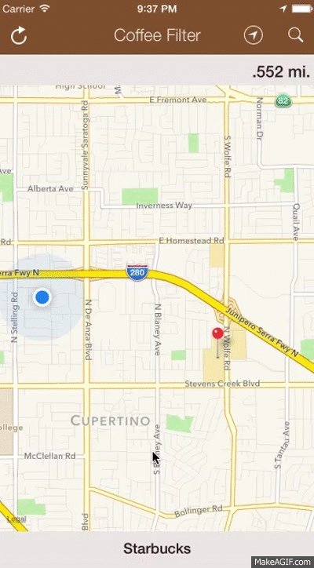

Coffee Filter - Find Coffee Fast
=========================

Full application detecting the closest coffee locations to you using Google Maps Lite.


### Get the App

Download from Google Play:
https://play.google.com/store/apps/details?id=com.refractored.coffeefilter

<table>
<tr>
<th>Android</th>
<th>iOS</th>
<th>Apple watch</th>
</tr>
<tr>
<td></td>
<td></td>
<td></td>
</tr>
<tr>
</table>

`Note:` iOS + Watch version is available for Test Flight beta testing, contact oleg.demchenko@xamarin.com for details.

### Blogs Generated From App
* [Using Google Maps Lite](http://blog.xamarin.com/android-tips-faster-maps-with-google-maps-lite/)
* [Easy Parallax Scrolling in Android](http://motzcod.es/post/113970191382/android-parallax-made-easy)
* [How Coffee Filter Was Created in 2 Day](http://motzcod.es/post/112797487377/coffee-filter-a-c-powered-android-app-in-2-days)

Maps & Places (special note)
----

To use the Google Maps API on Android you must generate an **API key** and add it to your Android project. See the Xamarin doc on [obtaining a Google Maps API key](http://developer.xamarin.com/guides/android/platform_features/maps_and_location/maps/obtaining_a_google_maps_api_key/). After following those instructions, paste the **API key** in the `Properties/AndroidManifest.xml` file (view source and find/update the following element):

    <meta-data android:name="com.google.android.maps.v2.API_KEY" android:value="APIKeyGoesHere" />

You need to follow these instructions in order for the map data to display in MobileCRM on Android.

To use Google Maps API on iOS you should generate another one **API key** for iOS application and add it to `AppDelegate.cs` file:
```
const string GoogleMapsAPIKey = "APIKeyGoesHere";
```

Please follow [Xamarin Watch Kit getting started guide](http://developer.xamarin.com/guides/ios/watch/getting-started/) to learn how to run watch app. Also make sure that you have correct provisioning profiles setup.

**Places Rest API**
In addition to this you must toggle on `Places API` under Services in your Google API Console. Then you can create a new “Simple API Access Key” that can be used in the `CoffeeFilterViewModel.cs` file.


### Development by:
- James Montemagno: [Twitter](http://www.twitter.com/jamesmontemagno) | [Blog](http://motzcod.es) | [GitHub](http://www.github.com/jamesmontemagno)

- Oleg Demchenko: [GitHub](http://www.github.com/olegoid)

- Design inspiration from [Frank Krueger](https://twitter.com/praeclarum) from when we were drinking coffee :)


### Technology Use
* Awesome Libraries:
* [Geolocator Plugin](https://components.xamarin.com/view/GeolocatorPlugin) - Simple cross platform geolocation
* [Connectivity Plugin](https://components.xamarin.com/view/ConnectivityPlugin) - Simple cross platform API to check connectivity.
* [ServiceStack.Text](https://components.xamarin.com/view/servicestacktext) - Simple json serialization and deserialization!
* [External Maps Plugin](https://components.xamarin.com/view/ExternalMapsPlugin) - Launch map app from shared code.

### Coming Soon
* Pull to Refresh
* Easier to Navigate
* Ability to move pin while moving

### License
The MIT License (MIT)

Copyright (c) 2014 James Montemagno / Refractored LLC