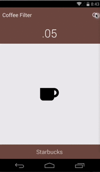

Coffee Filter - Find Coffee Fast
=========================

Sample application detecting the closest coffee locations to you using Google Maps Lite.

See the full blog post on the Xamarin Blog: http://blog.xamarin.com/android-tips-faster-maps-with-google-maps-lite/

### Try the Demo

Download from Google Play:
https://play.google.com/store/apps/details?id=com.refractored.coffeefilter

Maps & Places (special note)
----

To use the Google Maps API on Android you must generate an **API key** and add it to your Android project. See the Xamarin doc on [obtaining a Google Maps API key](http://developer.xamarin.com/guides/android/platform_features/maps_and_location/maps/obtaining_a_google_maps_api_key/). After following those instructions, paste the **API key** in the `Properties/AndroidManifest.xml` file (view source and find/update the following element):

    <meta-data android:name="com.google.android.maps.v2.API_KEY" android:value="AbCdEfGhIjKlMnOpQrStUvWValueGoesHere" />

You need to follow these instructions in order for the map data to display in MobileCRM on Android.

**Places Rest API**
In addition to this you must toggle on `Places API` under Services in your Google API Console. Then you can create a new “Simple API Access Key” that can be used in the `CoffeeFilterViewModel.cs` file.

### Development by:
- James Montemagno: [Twitter](http://www.twitter.com/jamesmontemagno) | [Blog](http://motzcod.es) | [GitHub](http://www.github.com/jamesmontemagno)

- Design inspiration from [Frank Krueger](https://twitter.com/praeclarum) from when we were drinking coffee :)

### Technology Use
* Awesome Libraries:
* [Geolocator Plugin](https://components.xamarin.com/view/GeolocatorPlugin) - Simple cross platform geolocation
* [Connectivity Plugin](https://components.xamarin.com/view/ConnectivityPlugin) - Simple cross platform API to check connectivity.
* [ServiceStack.Text](https://components.xamarin.com/view/servicestacktext) - Simple json serialization and deserialization!
* [External Maps Plugin](https://components.xamarin.com/view/ExternalMapsPlugin) - Launch map app from shared code.

### License
The MIT License (MIT)

Copyright (c) 2014 James Montemagno / Refractored LLC
